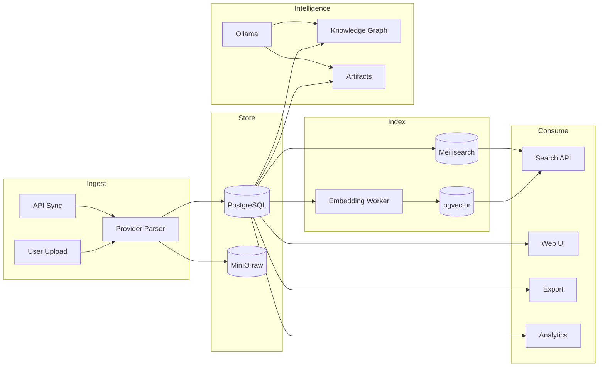

# Data Flow Overview

High-level data movement in C.O.R.T.E.X.. Detailed per-provider flows are in planning docs.

---

## Primary Flows

| Flow | Document |
|------|----------|
| Import (all providers) | [Import Pipelines](../planning/data-flow/import-pipelines.md) |
| Provider schemas | [Provider Schemas](../planning/data-flow/provider-schemas.md) |
| Search | [Sequence: Search](../planning/sequence/search.md) |
| Artifact generation | [Sequence: Artifact](../planning/sequence/artifact-generation.md) |
| Knowledge graph | [Sequence: KG Build](../planning/sequence/knowledge-graph-build.md) |

---

## End-to-End Data Lifecycle

---

## Related Documents

- [C4 Container Diagram](../planning/architecture/c4-container.md)
- [Privacy Model](../planning/privacy-model.md)
