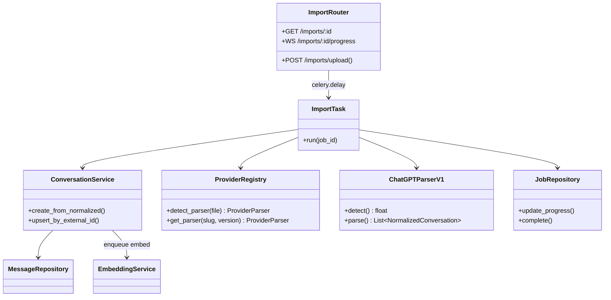
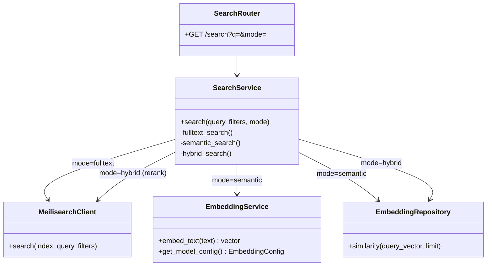

# C4 Model — Level 4: Code-Level View

**Selected Code Structures — Import & Search Paths**

This level documents package boundaries and key classes for the two highest-traffic code paths. Full implementation occurs in Stage 2.

---

## Package Structure (API)

```
apps/api/app/
├── main.py                 # FastAPI app factory, lifespan, router mount
├── config.py               # Settings (Pydantic BaseSettings)
├── database.py             # AsyncEngine, sessionmaker
├── dependencies.py         # get_db, get_current_user, rate_limit
├── middleware/
│   ├── auth.py
│   ├── rate_limit.py
│   ├── logging.py
│   └── cors.py
├── routers/                # Thin: validate → service → response
├── services/               # Business logic, no HTTP concerns
├── workers/
│   ├── celery_app.py
│   └── tasks/
├── providers/              # Versioned parsers
├── models/                 # SQLAlchemy ORM
├── schemas/                # Pydantic v2 request/response
└── utils/
    ├── crypto.py           # AES-GCM, DEK wrap/unwrap
    └── tokens.py           # JWT encode/decode
```

---

## Code Diagram: Import Pipeline



---

## Code Diagram: Search Pipeline



---

## Key Models (ORM)

| Model | Table | Primary Relationships |
|-------|-------|----------------------|
| `User` | users | → sessions, conversations, workspaces |
| `Conversation` | conversations | → messages, provider, workspace |
| `Message` | messages | → conversation (partitioned) |
| `Embedding` | embeddings | polymorphic entity_type/entity_id |
| `Job` | jobs | → user, celery_task_id |
| `KnowledgeNode` | knowledge_nodes | → knowledge_edges |
| `Artifact` | artifacts | → user, workspace |

---

## Frontend Code Boundaries

```
apps/web/src/
├── app/(auth)/             # Public auth pages
├── app/(app)/              # Protected shell
│   ├── conversations/      # List + [id] detail
│   ├── search/             # Search results
│   └── ...
├── components/features/
│   ├── import/             # Dropzone, progress WS
│   ├── conversations/      # Virtualized list
│   └── search/             # Query bar, filters
├── hooks/
│   ├── use-conversations.ts
│   ├── use-search.ts
│   └── use-job-progress.ts
└── lib/api.ts              # ApiClient class
```

---

## Testing Boundaries

| Layer | Tool | Scope |
|-------|------|-------|
| Unit | pytest / Vitest | Services, parsers, crypto |
| Integration | pytest-asyncio | API + test DB |
| E2E | Playwright | Import → search flow |

Fixtures: `examples/sample-data/` — 50 synthetic conversations per provider.

---

## Related Documents

- [C4 Component](./c4-component.md)
- [Sequence: Import](../sequence/import.md)
- [Sequence: Search](../sequence/search.md)
- [Folder Structure](../../architecture/folder-structure.md)
