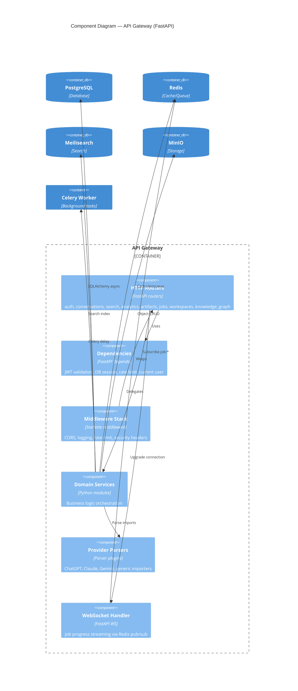
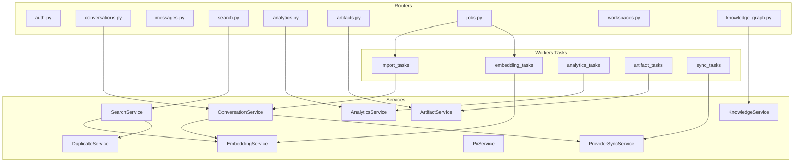

# C4 Model — Level 3: Component Diagram

**FastAPI API Gateway — Internal Components**



---

## Domain Services (Component Detail)



---

## Web Application Components

| Component | Location | Responsibility |
|-----------|----------|----------------|
| **App Router pages** | `apps/web/src/app/` | Route segments, layouts, SSR |
| **Feature components** | `components/features/` | Conversation list, import wizard, search |
| **UI primitives** | `components/ui/` | shadcn/ui base |
| **Visualizations** | `components/visualizations/` | Recharts, Sigma.js graph |
| **API client** | `lib/api.ts` | Typed fetch wrapper |
| **Auth** | `lib/auth.ts` | Auth.js 5 config |
| **Stores** | `stores/` | Zustand client state |
| **Hooks** | `hooks/` | TanStack Query hooks |

---

## Worker Components

| Task Module | Triggers | Output |
|-------------|----------|--------|
| `import_tasks` | File upload, API sync | Conversations + messages in PG |
| `embedding_tasks` | Post-import, reindex job | pgvector rows |
| `analytics_tasks` | Cron / manual | analytics_snapshots |
| `artifact_tasks` | User request | artifacts + MinIO objects |
| `sync_tasks` | Scheduled provider sync | Updated conversations |

---

## Provider Parser Interface

```python
# Conceptual contract (Stage 2 implementation)
class ProviderParser(Protocol):
    provider_slug: str
    schema_version: str

    def detect(self, raw: bytes) -> float: ...       # 0.0–1.0 confidence
    def parse(self, raw: bytes) -> list[NormalizedConversation]: ...
```

Implementations: `chatgpt/v1`, `claude/v1`, `gemini/v1`, `perplexity/v1`, `grok/v1`, `generic/json`, `generic/markdown`.

---

## Related Documents

- [C4 Container](./c4-container.md)
- [C4 Code](./c4-code.md)
- [Data Flow: Import](../data-flow/import-pipelines.md)
