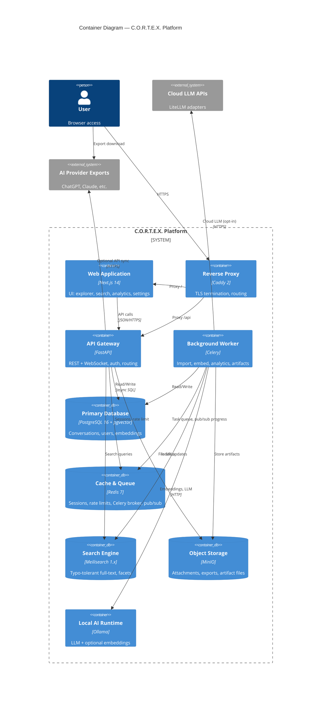
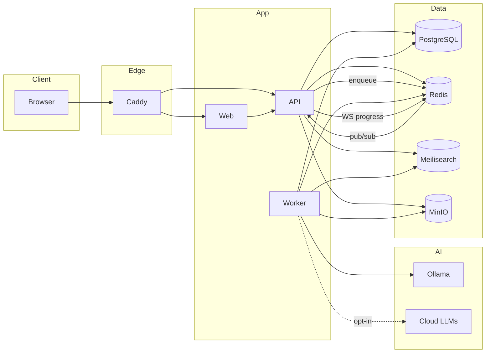

# C4 Model — Level 2: Container Diagram

**C.O.R.T.E.X. Platform — Deployable Containers**

---

## Container Descriptions

| Container | Technology | Responsibility | Scaling |
|-----------|------------|----------------|---------|
| **Web Application** | Next.js 14, TypeScript | SSR/CSR UI, Auth.js session, TanStack Query | Horizontal (stateless) |
| **Reverse Proxy** | Caddy 2 | Auto HTTPS, path routing, security headers | Single or HA pair |
| **API Gateway** | FastAPI 0.115+ | Auth, REST API, WebSockets (job progress) | Horizontal |
| **Background Worker** | Celery 5 + Redis | Long-running: import, embed, analytics, KG, artifacts | Horizontal by queue |
| **PostgreSQL** | PG 16 + pgvector | Source of truth, FTS, vector similarity | Vertical + read replicas |
| **Redis** | Redis 7 | Broker, cache, rate limit, pub/sub | Sentinel/cluster optional |
| **Meilisearch** | 1.x | Fast facet search, typo tolerance | Single node (Tier 1) |
| **MinIO** | S3-compatible | Blobs: uploads, PDF exports, artifact HTML | Distributed optional |
| **Ollama** | Latest | Local llama3, mistral, nomic-embed | GPU node |

---

## Inter-Container Communication

---

## Deployment Profiles

| Profile | Compose File | Containers |
|---------|--------------|------------|
| **Minimal** | `docker-compose.minimal.yml` | caddy, web, api, worker, postgres, redis, meili, minio |
| **Standard** | `docker-compose.yml` | + ollama |
| **Full observability** | `docker-compose.prod.yml` | + prometheus, grafana, loki, jaeger |

---

## Container-Level Security

| Container | Exposure | Auth |
|-----------|----------|------|
| Caddy | Public :443/:80 | TLS |
| Web | Internal only | Session cookie |
| API | Internal (+ public via Caddy) | JWT RS256 |
| Worker | Internal only | Service credentials |
| PostgreSQL | Internal only | SCRAM auth |
| Redis | Internal only | Password |
| Meilisearch | Internal only | Master key |
| MinIO | Internal only | Access key |
| Ollama | Internal only | None (network isolated) |

---

## Related Documents

- [C4 Context](./c4-context.md)
- [C4 Component](./c4-component.md)
- [TDR: Caddy](../tdr/005-caddy-over-nginx.md)
