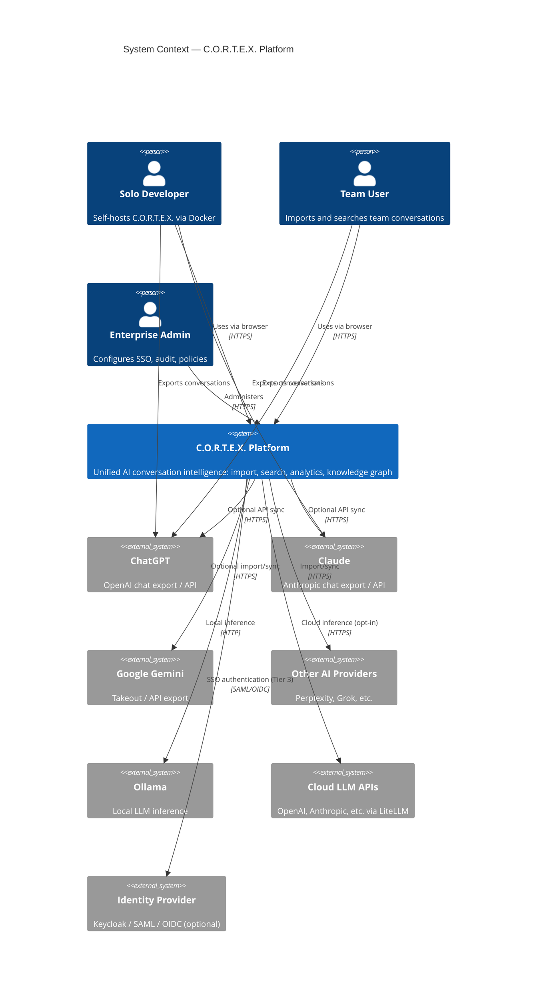

# C4 Model — Level 1: System Context

**C.O.R.T.E.X. AI Conversation Intelligence Platform**

The Context diagram shows C.O.R.T.E.X. as a system and its relationships with users and external systems.



---

## System Purpose

C.O.R.T.E.X. sits **between users and their fragmented AI conversation history**. It does not replace AI chat interfaces; it ingests, indexes, analyzes, and surfaces knowledge from conversations across providers.

## External Actors

| Actor | Interaction | Data Flow Direction |
|-------|-------------|---------------------|
| Solo Developer | Deploy, import, search locally | User → C.O.R.T.E.X. (files, queries) |
| Team User | Shared workspace, collaboration | User ↔ C.O.R.T.E.X. |
| Enterprise Admin | SSO, audit, retention policies | Admin → C.O.R.T.E.X. (config) |
| AI Providers | Export files or API sync | Provider → C.O.R.T.E.X. (conversations) |
| Ollama | Embeddings, summarization, artifacts | C.O.R.T.E.X. → Ollama (prompts) |
| Cloud LLMs | Optional acceleration | C.O.R.T.E.X. → LiteLLM → Provider |
| Identity Provider | Enterprise SSO | C.O.R.T.E.X. ↔ IdP (tokens) |

## Trust Boundaries

```
┌─────────────────────────────────────────────────────────┐
│  TRUST ZONE: User-controlled infrastructure             │
│  ┌───────────────────────────────────────────────────┐  │
│  │  C.O.R.T.E.X. (all services, DB, cache, search, storage) │  │
│  │  Ollama (local)                                   │  │
│  └───────────────────────────────────────────────────┘  │
└─────────────────────────────────────────────────────────┘
         │ opt-in only                    │ user-initiated
         ▼                                ▼
   Cloud LLM APIs                   AI Provider exports
   (LiteLLM)                        (file upload / API sync)
```

## Key Context-Level Requirements

- **No mandatory external calls** — core import, search, analytics work offline after initial deploy.
- **Explicit opt-in** for cloud LLM and provider API sync.
- **Self-hosted** — user owns all data at rest (PostgreSQL, MinIO).

---

## Related Documents

- [C4 Container](./c4-container.md)
- [PRD](../PRD.md)
- [Privacy Model](../privacy-model.md)
