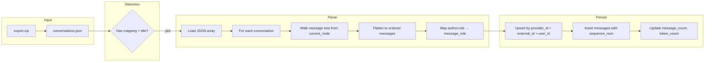
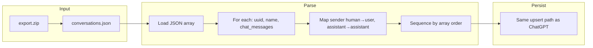
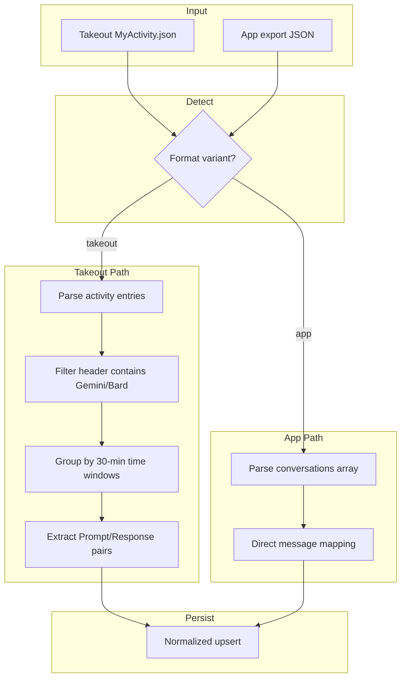
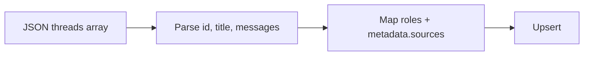
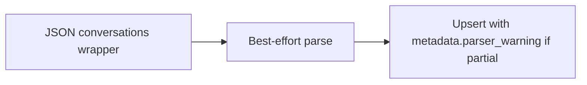
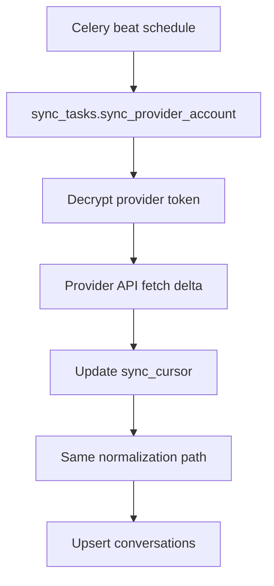

# Data Flow — Import Pipelines

Per-provider import data flows from user upload to searchable indexed conversation.

---

## Master Import Flow

```mermaid
flowchart TB
    subgraph User
        U[Upload export file]
    end

    subgraph API
        A1[POST /api/v1/imports/upload]
        A2[Validate auth + quota]
        A3[Store raw file in MinIO]
        A4[Create job record status=queued]
        A5[Enqueue Celery import_task]
    end

    subgraph Worker
        W1[Fetch file from MinIO]
        W2[ProviderRegistry.detect_parser]
        W3[Parser.parse → NormalizedConversation[]]
        W4[ConversationService.upsert batch]
        W5[Publish progress via Redis pub/sub]
        W6[Enqueue embed_batch job]
        W7[Update Meilisearch index]
        W8[Mark job completed]
    end

    subgraph Storage
        PG[(PostgreSQL)]
        MS[(Meilisearch)]
        MO[(MinIO)]
        RD[(Redis)]
    end

    U --> A1
    A1 --> A2 --> A3 --> MO
    A2 --> A4 --> PG
    A4 --> A5 --> RD
    A5 --> W1
    W1 --> MO
    W1 --> W2 --> W3 --> W4 --> PG
    W4 --> W5 --> RD
    W4 --> W6
    W6 --> W7 --> MS
    W7 --> W8 --> PG
```

---

## ChatGPT Import Pipeline



**Error paths:**
- Missing `conversations.json` → job failed, error: `MISSING_PRIMARY_FILE`
- Broken tree (orphan nodes) → skip orphans, warn if > 5% messages lost
- Duplicate re-import → upsert messages by `external_id`, no duplicates

---

## Claude Import Pipeline



---

## Gemini Import Pipeline



---

## Perplexity Import Pipeline



---

## Grok Import Pipeline



---

## Post-Import Indexing Pipeline

Runs for **all providers** after successful parse:

```mermaid
flowchart LR
    subgraph embed_batch Job
        E1[Load unembedded messages]
        E2[Chunk text 512 tokens, overlap 64]
        E3[sentence-transformers encode]
        E4[INSERT embeddings entity_type=message]
        E5[Aggregate conversation embedding mean pool]
        E6[INSERT embeddings entity_type=conversation]
    end

    subgraph meilisearch
        M1[Bulk index conversations]
        M2[Bulk index messages searchable attrs]
    end

    subgraph duplicate_detection
        DUP[Queue detect_duplicates job async]
    end

    E1 --> E2 --> E3 --> E4 --> E5 --> E6
    E6 --> M1 --> M2
    M2 --> DUP
```



---

## API Sync Pipeline (Tier 2)



---

## Data Classification During Import

| Data element | Classification | Storage |
|--------------|----------------|---------|
| Raw upload file | Confidential | MinIO (encrypted at rest) |
| Parsed messages | Internal | PostgreSQL |
| Provider tokens | Restricted | PostgreSQL BYTEA encrypted |
| Embeddings | Internal | PostgreSQL pgvector |
| Job progress | Internal | Redis (TTL 24h) |

---

## Related Documents

- [Provider Schemas](./provider-schemas.md)
- [Sequence: Import](../sequence/import.md)
- [Privacy Model](../privacy-model.md)
