# Entity-Relationship Diagram (ERD)

**C.O.R.T.E.X. Database Schema v1.0 — PostgreSQL 16 + pgvector**

> **Note:** Default embedding dimension is **384** (`all-MiniLM-L6-v2`). See [pre-stage2-decisions.md](./pre-stage2-decisions.md).

---

## Full ERD (Mermaid)

```mermaid
erDiagram
    users ||--o{ sessions : has
    users ||--o{ api_keys : owns
    users ||--o{ workspaces : owns
    users ||--o{ workspace_members : belongs
    users ||--o{ conversations : owns
    users ||--o{ folders : organizes
    users ||--o{ knowledge_nodes : creates
    users ||--o{ artifacts : generates
    users ||--o{ jobs : triggers
    users ||--o{ analytics_snapshots : has
    users ||--o{ audit_logs : performs
    users ||--o{ provider_accounts : connects

    workspaces ||--o{ workspace_members : includes
    workspaces ||--o{ conversations : contains
    workspaces ||--o{ folders : contains
    workspaces ||--o{ knowledge_nodes : scopes
    workspaces ||--o{ artifacts : scopes
    workspaces ||--o{ provider_accounts : scopes
    workspaces ||--o{ analytics_snapshots : aggregates
    workspaces ||--o{ audit_logs : scopes

    providers ||--o{ conversations : sources
    providers ||--o{ provider_accounts : type

    provider_accounts ||--o{ conversations : syncs

    conversations ||--o{ messages : contains
    conversations ||--o{ duplicate_pairs : "pair A"
    conversations ||--o{ duplicate_pairs : "pair B"
    conversations }o--o| folders : "in folder"

    messages ||--o{ pii_redactions : has
    messages ||--o{ messages : "parent branch"

    knowledge_nodes ||--o{ knowledge_edges : "source"
    knowledge_nodes ||--o{ knowledge_edges : "target"

    users {
        uuid id PK
        varchar email UK
        varchar username UK
        varchar display_name
        varchar hashed_password
        text avatar_url
        varchar role
        boolean is_active
        boolean is_verified
        text totp_secret
        jsonb preferences
        bigint storage_quota
        bigint storage_used
        bytea encrypted_dek
        bytea dek_iv
        varchar encryption_mode
        timestamptz created_at
        timestamptz updated_at
        timestamptz last_login_at
        timestamptz deleted_at
    }

    sessions {
        uuid id PK
        uuid user_id FK
        varchar token_hash UK
        inet ip_address
        text user_agent
        timestamptz expires_at
        timestamptz revoked_at
        timestamptz created_at
    }

    api_keys {
        uuid id PK
        uuid user_id FK
        varchar name
        varchar key_hash UK
        varchar key_prefix
        text_array scopes
        timestamptz last_used_at
        timestamptz expires_at
        timestamptz created_at
        timestamptz revoked_at
    }

    workspaces {
        uuid id PK
        uuid owner_id FK
        varchar slug UK
        varchar name
        text description
        text avatar_url
        varchar plan
        jsonb settings
        boolean is_public
        timestamptz created_at
        timestamptz updated_at
        timestamptz deleted_at
    }

    workspace_members {
        uuid id PK
        uuid workspace_id FK
        uuid user_id FK
        varchar role
        uuid invited_by FK
        timestamptz joined_at
    }

    providers {
        uuid id PK
        varchar slug UK
        varchar name
        text icon_url
        varchar export_format
        varchar parser_version
        boolean is_active
        jsonb capabilities
        timestamptz created_at
    }

    provider_accounts {
        uuid id PK
        uuid user_id FK
        uuid workspace_id FK
        uuid provider_id FK
        varchar display_name
        bytea encrypted_token
        bytea token_iv
        bytea refresh_token
        timestamptz token_expires
        jsonb sync_cursor
        timestamptz last_synced_at
        boolean is_active
        jsonb metadata
        timestamptz created_at
        timestamptz updated_at
    }

    conversations {
        uuid id PK
        uuid user_id FK
        uuid workspace_id FK
        uuid provider_id FK
        uuid provider_account_id FK
        varchar external_id
        text title
        text summary
        enum status
        enum import_source
        int message_count
        int token_count
        varchar language
        text_array topics
        text_array tags
        uuid folder_id FK
        boolean is_pinned
        boolean is_shared
        varchar share_token UK
        float quality_score
        jsonb metadata
        timestamptz started_at
        timestamptz ended_at
        timestamptz created_at
        timestamptz updated_at
        timestamptz deleted_at
    }

    messages {
        uuid id PK
        uuid conversation_id FK
        varchar external_id
        enum role
        text content
        varchar content_type
        varchar model
        int token_count
        jsonb attachments
        jsonb tool_calls
        jsonb metadata
        uuid parent_id FK
        int sequence_num
        timestamptz created_at
        timestamptz updated_at
    }

    embeddings {
        uuid id PK
        varchar entity_type
        uuid entity_id
        varchar model
        int dimensions
        vector embedding
        text chunk_text
        int chunk_index
        timestamptz created_at
    }

    folders {
        uuid id PK
        uuid user_id FK
        uuid workspace_id FK
        uuid parent_id FK
        varchar name
        varchar color
        varchar icon
        int sort_order
        timestamptz created_at
        timestamptz updated_at
    }

    knowledge_nodes {
        uuid id PK
        uuid user_id FK
        uuid workspace_id FK
        text label
        enum node_type
        text description
        uuid_array source_ids
        int occurrence_count
        vector embedding
        jsonb metadata
        timestamptz created_at
        timestamptz updated_at
    }

    knowledge_edges {
        uuid id PK
        uuid source_id FK
        uuid target_id FK
        varchar relationship
        float weight
        jsonb evidence
        timestamptz created_at
    }

    artifacts {
        uuid id PK
        uuid user_id FK
        uuid workspace_id FK
        text title
        enum artifact_type
        enum status
        uuid_array source_ids
        text prompt
        varchar model_used
        jsonb content
        text storage_key
        bigint file_size
        int version
        boolean is_public
        varchar share_token UK
        text error_message
        int generation_ms
        jsonb metadata
        timestamptz created_at
        timestamptz updated_at
        timestamptz deleted_at
    }

    analytics_snapshots {
        uuid id PK
        uuid user_id FK
        uuid workspace_id FK
        varchar period_type
        date period_start
        date period_end
        jsonb metrics
        timestamptz created_at
    }

    jobs {
        uuid id PK
        uuid user_id FK
        uuid workspace_id FK
        enum job_type
        enum status
        int priority
        jsonb payload
        jsonb result
        text error_message
        float progress
        text progress_detail
        int attempts
        int max_attempts
        varchar celery_task_id
        timestamptz scheduled_at
        timestamptz started_at
        timestamptz completed_at
        timestamptz created_at
    }

    audit_logs {
        bigint id PK
        uuid user_id FK
        uuid workspace_id FK
        varchar action
        varchar resource_type
        uuid resource_id
        inet ip_address
        text user_agent
        jsonb before_state
        jsonb after_state
        jsonb metadata
        timestamptz created_at
    }

    duplicate_pairs {
        uuid id PK
        uuid conv_a_id FK
        uuid conv_b_id FK
        float similarity
        varchar detection_method
        boolean is_confirmed
        timestamptz created_at
    }

    pii_redactions {
        uuid id PK
        uuid message_id FK
        varchar pii_type
        varchar original_hash
        varchar replacement
        int offset_start
        int offset_end
        timestamptz created_at
    }
```



---

## Table Inventory (22 tables)

| # | Table | Domain | Est. Row Growth |
|---|-------|--------|-----------------|
| 1 | users | Auth | Low |
| 2 | sessions | Auth | Medium |
| 3 | api_keys | Auth | Low |
| 4 | workspaces | Teams | Low |
| 5 | workspace_members | Teams | Low |
| 6 | providers | Reference | Static (~6) |
| 7 | provider_accounts | Integrations | Low |
| 8 | conversations | Core | High |
| 9 | messages | Core | Very High (partitioned) |
| 10 | embeddings | Search | Very High |
| 11 | folders | Organization | Low |
| 12 | knowledge_nodes | Knowledge Graph | Medium |
| 13 | knowledge_edges | Knowledge Graph | Medium |
| 14 | artifacts | Generation | Medium |
| 15 | analytics_snapshots | Analytics | Low |
| 16 | jobs | Processing | Medium (TTL archive) |
| 17 | audit_logs | Security | High (append-only) |
| 18 | duplicate_pairs | Intelligence | Medium |
| 19 | pii_redactions | Privacy | Medium |
| 20–22 | messages_2024/25/26 | Partitions | Inherited |

---

## Relationship Cardinality Summary

| From | To | Cardinality | On Delete |
|------|-----|-------------|-----------|
| users | conversations | 1:N | CASCADE |
| conversations | messages | 1:N | CASCADE |
| conversations | embeddings | 1:N (via entity) | — |
| workspaces | conversations | 1:N | SET NULL |
| providers | conversations | 1:N | — |
| knowledge_nodes | knowledge_edges | N:M (via edges) | CASCADE |
| conversations | duplicate_pairs | N:M | CASCADE |

---

## Indexes (Critical Path)

| Table | Index | Purpose |
|-------|-------|---------|
| conversations | `(user_id, status) WHERE deleted_at IS NULL` | Dashboard list |
| conversations | GIN(topics), GIN(tags) | Filter |
| conversations | GIN(tsvector title+summary) | FTS |
| messages | `(conversation_id, sequence_num)` | Thread render |
| messages | GIN(tsvector content) | Message FTS |
| embeddings | HNSW(embedding) | Semantic search |
| embeddings | `(entity_type, entity_id)` | Lookup |
| jobs | `(user_id, status)` | Job monitor |
| audit_logs | `(user_id, created_at DESC)` | Audit query |

---

## Partitioning Strategy

**messages** — `PARTITION BY RANGE (created_at)`

| Partition | Range |
|-----------|-------|
| messages_2024 | 2024-01-01 → 2025-01-01 |
| messages_2025 | 2025-01-01 → 2026-01-01 |
| messages_2026 | 2026-01-01 → 2027-01-01 |
| messages_default | DEFAULT (catch-all for new years) |

**Operational rule:** Alembic migration creates next-year partition every Q4.

---

## Enums Reference

```sql
conversation_status: active | archived | deleted | processing
import_source: file_upload | api_sync | manual | webhook
message_role: user | assistant | system | tool | function
node_type: concept | person | tool | decision | insight | question | answer | entity
artifact_type: website | dashboard | report | presentation | wiki | mindmap | summary | timeline | dataset
artifact_status: pending | generating | ready | failed | stale
job_type: import_file | import_api_sync | embed_batch | reindex | generate_artifact | analyze_conversations | build_knowledge_graph | compute_analytics | detect_duplicates | redact_pii
job_status: queued | running | completed | failed | cancelled
```

---

## Schema Deviations from Original Spec (Stage 1 Resolutions)

| Original | Resolved |
|----------|----------|
| `vector(1536)` | `vector(384)` default; `dimensions` column tracks actual |
| No DEK columns on users | Added `encrypted_dek`, `dek_iv`, `encryption_mode` |
| `folders` FK on conversations without constraint | Stage 2 adds `FK folder_id → folders(id)` |

---

## Related Documents

- [Pre-Stage-2 Decisions](./pre-stage2-decisions.md)
- [Privacy Model](./privacy-model.md)
- Original DDL in project root spec (Stage 2 Alembic migration source)
