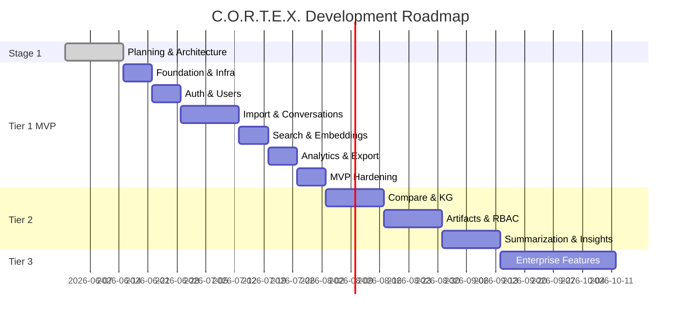
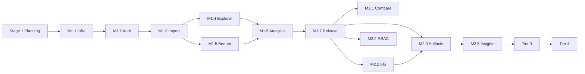

# C.O.R.T.E.X. Feature Roadmap

**Version:** 1.0  
**Horizon:** 20 weeks (Tiers 1–3) + Tier 4 ongoing

Each milestone includes **acceptance criteria** that must pass before the next tier begins.

---

## Timeline Overview

---

## Stage 1 — Planning & Architecture ✅

**Duration:** Weeks 1–2  
**Status:** Complete

### Deliverables
- [x] PRD with personas and KPIs
- [x] C4 diagrams (Context → Code)
- [x] ERD (22 tables)
- [x] Data flow diagrams (all import pipelines)
- [x] Sequence diagrams (Import, Search, Artifact, KG)
- [x] TDRs (5 decisions)
- [x] Privacy model
- [x] Threat model (STRIDE)
- [x] Pre-Stage-2 decisions resolved
- [x] Folder structure documented

### Gate Criteria
- [x] Zero open blocking questions for Stage 2
- [x] Security review of threat model complete
- [x] Embedding dimension decision documented (384)

---

## Tier 1 — MVP (Weeks 3–8)

**Theme:** Import, search, organize, analyze, export — fully self-hostable.

### M1.1 — Foundation & Infrastructure

| Feature | Acceptance Criteria |
|---------|---------------------|
| Docker Compose stack | `docker compose up` starts all Tier 1 services in < 3 min |
| PostgreSQL + pgvector | Extensions enabled; migrations run cleanly |
| Health endpoints | `/health`, `/ready`, `/live` return correct status |
| Makefile | `make dev-up`, `make test`, `make migrate` work |
| CI pipeline | GitHub Actions: lint + test on PR |

**Definition of Done:** New developer clones repo, runs `make dev-up`, sees green health checks.

---

### M1.2 — Authentication & Multi-User

| Feature | Acceptance Criteria |
|---------|---------------------|
| Registration / login | User can register, login, logout |
| JWT RS256 | Access + refresh token flow works |
| Session management | Sessions listed and revocable |
| Next.js auth shell | Protected routes redirect unauthenticated users |
| Argon2id | Password hashing verified in unit tests |

**Definition of Done:** Two users on same instance cannot access each other's data.

---

### M1.3 — Conversation Import

| Feature | Acceptance Criteria |
|---------|---------------------|
| ChatGPT import | 50 sample conversations import with 99%+ success |
| Claude import | Sample file imports correctly |
| Gemini import | Takeout format imports (synthetic grouping) |
| Generic JSON/MD | Custom format imports |
| Background jobs | Import runs in Celery with WS progress |
| Idempotent re-import | Re-upload same file → no duplicates |
| Versioned parsers | `detect()` selects correct parser |

**Definition of Done:** Alex persona imports ChatGPT export in < 15 min total.

---

### M1.4 — Conversation Explorer

| Feature | Acceptance Criteria |
|---------|---------------------|
| List view | Virtualized list handles 10K conversations |
| Detail view | Full message thread with roles rendered |
| Tags, folders, pin | CRUD operations persist |
| Filters | By provider, date, tag, folder |
| Archive / soft delete | Deleted conversations hidden from default view |

**Definition of Done:** Jordan persona finds any imported conversation in < 30 seconds.

---

### M1.5 — Search

| Feature | Acceptance Criteria |
|---------|---------------------|
| Full-text search | Meilisearch returns results < 200ms p95 |
| Semantic search | pgvector similarity < 500ms p95 |
| Hybrid mode | RRF merge outperforms either alone (manual eval) |
| Embeddings | all-MiniLM-L6-v2, 384-dim, auto-generated post-import |
| Duplicate detection | Pairs with similarity > 0.85 surfaced in UI |

**Definition of Done:** Search "kubernetes deployment" returns relevant results in top 5.

---

### M1.6 — Analytics & Export

| Feature | Acceptance Criteria |
|---------|---------------------|
| Usage dashboard | Conversations, messages, tokens by provider |
| Daily snapshots | Celery beat computes analytics_snapshots |
| Export JSON/MD/CSV | Bulk export by filter |
| Export PDF | Single conversation PDF renders |
| Ollama integration | Local model listed in settings (optional pull) |

**Definition of Done:** Dashboard loads < 2s; export downloads valid files.

---

### M1.7 — MVP Release

| Feature | Acceptance Criteria |
|---------|---------------------|
| README quick-start | Solo dev deploy documented |
| `.env.example` | All vars documented |
| Security baseline | Tier 1 threat mitigations implemented |
| E2E test | Playwright: register → import → search |
| Docker images | Published to ghcr.io on tag |

**Tier 1 Gate:** All M1.x acceptance criteria pass; zero critical security findings.

---

## Tier 2 — Growth (Weeks 9–14)

**Theme:** Intelligence, collaboration, artifacts.

### M2.1 — Cross-Platform Compare

| Feature | Acceptance Criteria |
|---------|---------------------|
| Side-by-side diff | Two conversations compared with highlighted differences |
| Same-topic detection | Suggests comparable conversations |

---

### M2.2 — Knowledge Graph

| Feature | Acceptance Criteria |
|---------|---------------------|
| Graph build job | Workspace-scoped build completes with progress |
| Entity extraction | spaCy + Ollama concepts extracted |
| Sigma.js visualization | Interactive graph with zoom/pan |
| Incremental updates | New messages add nodes without full rebuild |

---

### M2.3 — Artifact Generator

| Feature | Acceptance Criteria |
|---------|---------------------|
| Wiki generation | Markdown/HTML wiki from selected conversations |
| Report generation | PDF report with sections |
| Presentation | HTML slide deck |
| Local + cloud LLM | Ollama default; LiteLLM opt-in |

---

### M2.4 — Collaboration

| Feature | Acceptance Criteria |
|---------|---------------------|
| Workspace sharing | Invite users by email/username |
| RBAC | owner/admin/member/viewer enforced on all routes |
| Share tokens | Read-only public link for conversation |
| Provider API sync | ChatGPT/Claude delta sync (where supported) |

---

### M2.5 — AI Insights

| Feature | Acceptance Criteria |
|---------|---------------------|
| Summarization | Per-conversation summary via local LLM |
| Topic clustering | BERTopic clusters visible in analytics |
| Trend detection | Weekly topic trend chart |
| AI suggestions | "Related conversations" widget |

**Tier 2 Gate:** Morgan persona shares workspace with 3 members; Sam persona explores knowledge graph.

---

## Tier 3 — Scale (Weeks 15–20)

**Theme:** Enterprise readiness, automation, governance.

### M3.1 — Plugin System

| Feature | Acceptance Criteria |
|---------|---------------------|
| Custom importers | Plugin API documented; sample plugin loads |
| Plugin discovery | Enabled via workspace settings |

---

### M3.2 — Automation

| Feature | Acceptance Criteria |
|---------|---------------------|
| Webhooks | POST on conversation.imported, artifact.ready |
| n8n compatibility | Sample n8n workflow documented |
| API keys | Scoped keys with rate limits |

---

### M3.3 — Enterprise Auth

| Feature | Acceptance Criteria |
|---------|---------------------|
| Keycloak integration | Optional compose profile |
| SAML 2.0 | SSO login flow works |
| OIDC | SSO login flow works |

---

### M3.4 — Governance

| Feature | Acceptance Criteria |
|---------|---------------------|
| Audit logging | All mutating API calls logged |
| Tamper-evident storage | Hash chain on audit_logs |
| Multi-tenant mode | Tenant isolation in shared deployment |
| PII redaction | Pipeline detects and redacts standard PII |
| Anonymization | Export with PII stripped |

---

### M3.5 — Integrations

| Feature | Acceptance Criteria |
|---------|---------------------|
| Slack ingestion | Bot receives forwarded conversations |
| Teams / Discord | Webhook ingestion documented |
| Model benchmarking | Compare model performance across providers |
| Prompt template library | CRUD for reusable prompts |

**Tier 3 Gate:** Riley persona passes internal security review; SSO live in staging.

---

## Tier 4 — Advanced AI (Ongoing)

| Feature | Priority | Acceptance Criteria |
|---------|----------|---------------------|
| RAG over history | P1 | Question answered with cited conversations |
| Fact extraction | P1 | Facts linked to source messages |
| Contradiction detection | P2 | Conflicting statements flagged |
| Auto knowledge base | P2 | Cluster → wiki auto-generated |
| Persona analysis | P2 | Model performance by task type chart |
| Quality scoring | P2 | quality_score computed per conversation |
| Auto-tagging | P2 | 80%+ tag precision on sample set |
| Multi-modal | P3 | Images/PDFs in message attachments searchable |
| Memory assistant | P1 | "What did I ask about X?" answered accurately |

---

## Milestone Dependencies

---

## Related Documents

- [PRD](./PRD.md)
- [Pre-Stage-2 Decisions](./pre-stage2-decisions.md)
