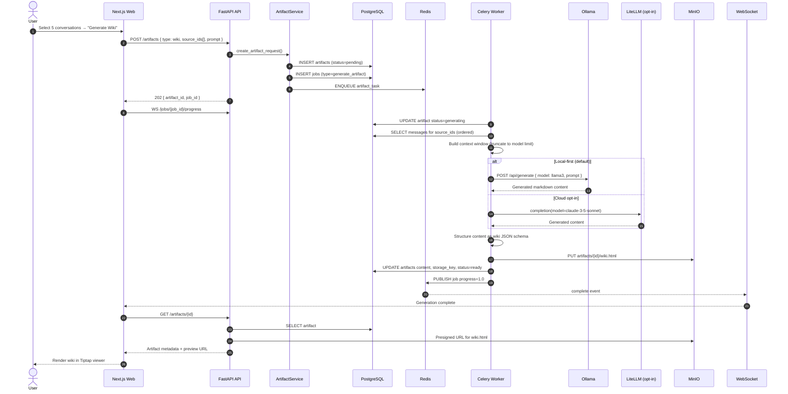
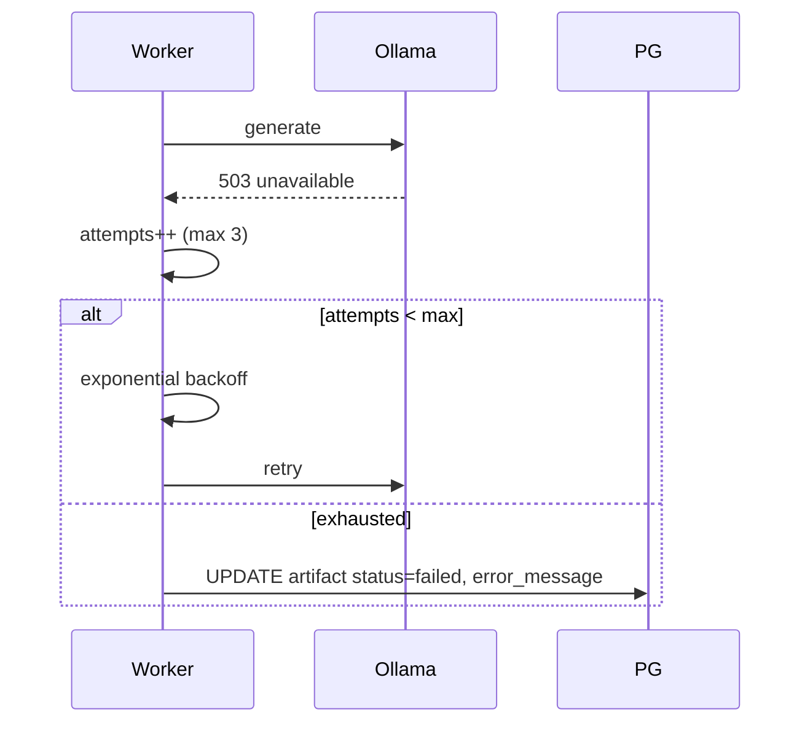

# Sequence Diagram — Artifact Generation

Tier 2 feature: generate wiki, report, or presentation from selected conversations.

---

## Artifact Types & Output

| Type | Output | MinIO key | content JSONB |
|------|--------|-----------|---------------|
| wiki | HTML + MD | `artifacts/{id}/wiki.html` | Tiptap document tree |
| report | PDF | `artifacts/{id}/report.pdf` | Section outline |
| presentation | HTML slides | `artifacts/{id}/deck/` | Slide array |
| summary | Markdown | — | Text only |
| mindmap | JSON graph | — | nodes + edges |

---

## Failure & Retry

---

## Related Documents

- [TDR: LiteLLM](../tdr/004-litellm-ai-routing.md)
- [Roadmap — Tier 2](../roadmap.md)
