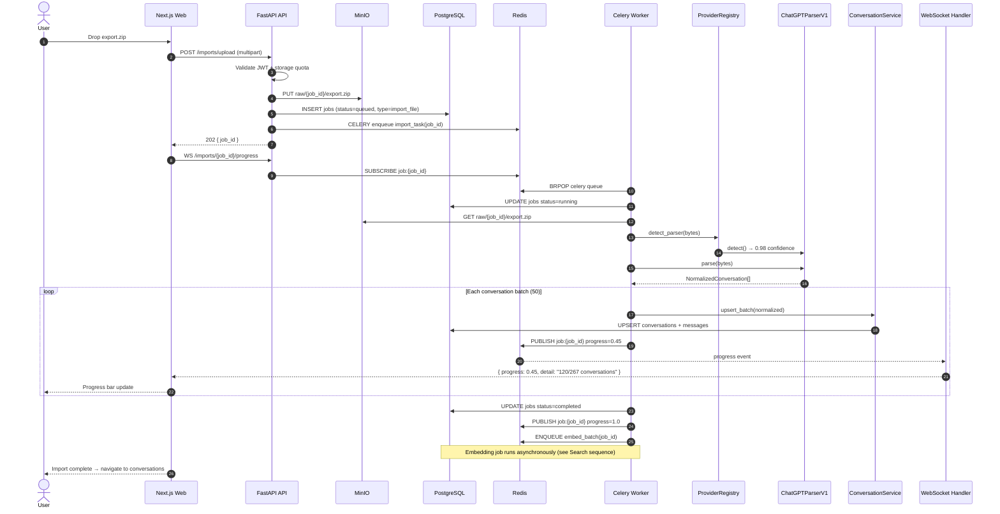
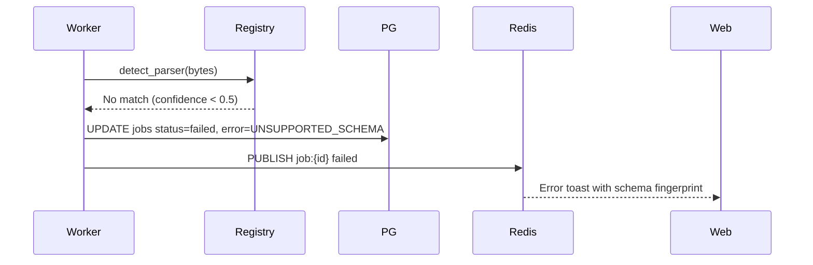
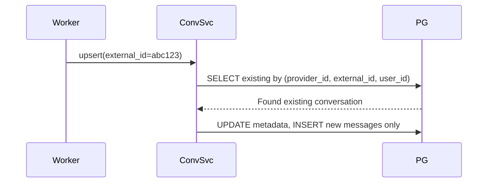

# Sequence Diagram — Conversation Import

End-to-end flow from file upload to searchable conversation.

---

## Alternate Flows

### Parse failure

### Re-import (idempotent)

---

## Related Documents

- [Import Pipelines](../data-flow/import-pipelines.md)
- [Provider Schemas](../data-flow/provider-schemas.md)
