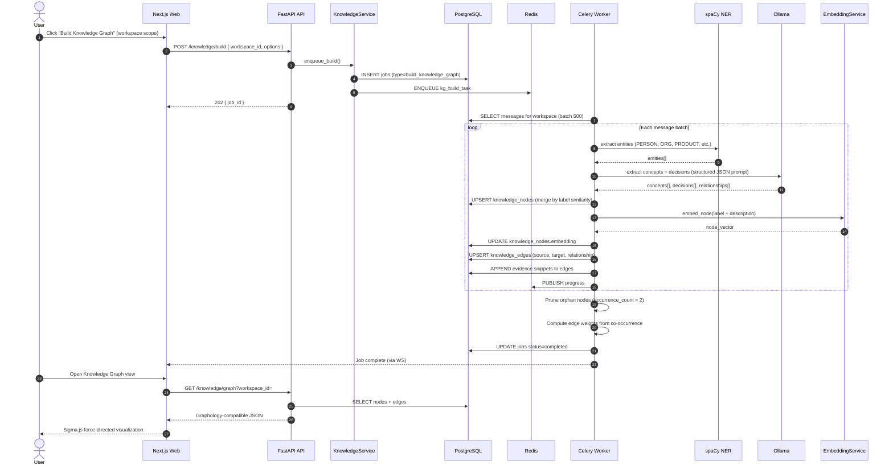
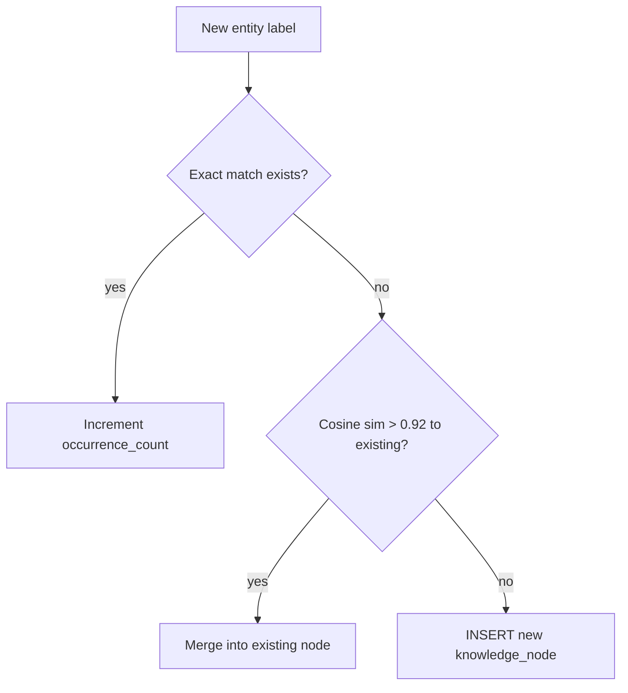
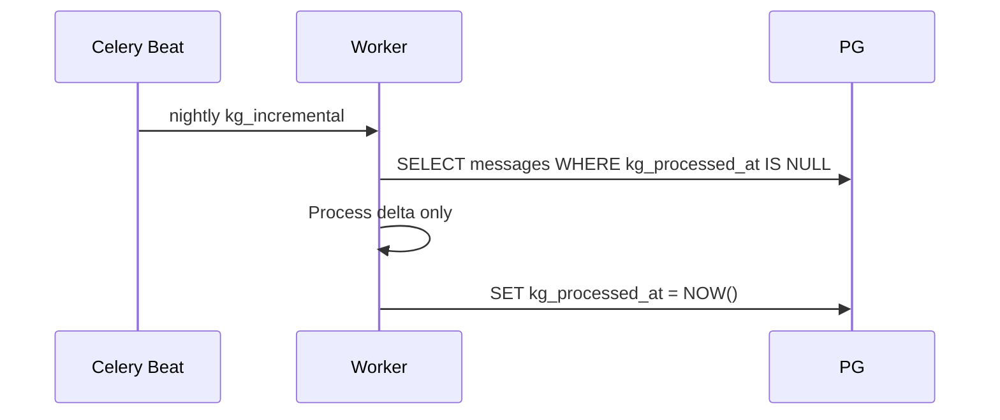

# Sequence Diagram — Knowledge Graph Build

Tier 2 feature: extract entities and relationships from conversations into knowledge graph.

---

## Node Merge Strategy

---

## Relationship Types

| relationship | Example |
|--------------|---------|
| relates_to | "Kubernetes" relates_to "Docker" |
| leads_to | "Architecture review" leads_to "Microservices decision" |
| contradicts | "Use MongoDB" contradicts "Use PostgreSQL" |
| mentions | "Project Alpha" mentions "Jordan" |
| answers | Message pair user question → assistant answer |

---

## Incremental Update (scheduled)

---

## Related Documents

- [ERD](../erd.md)
- [Roadmap — Tier 2](../roadmap.md)
