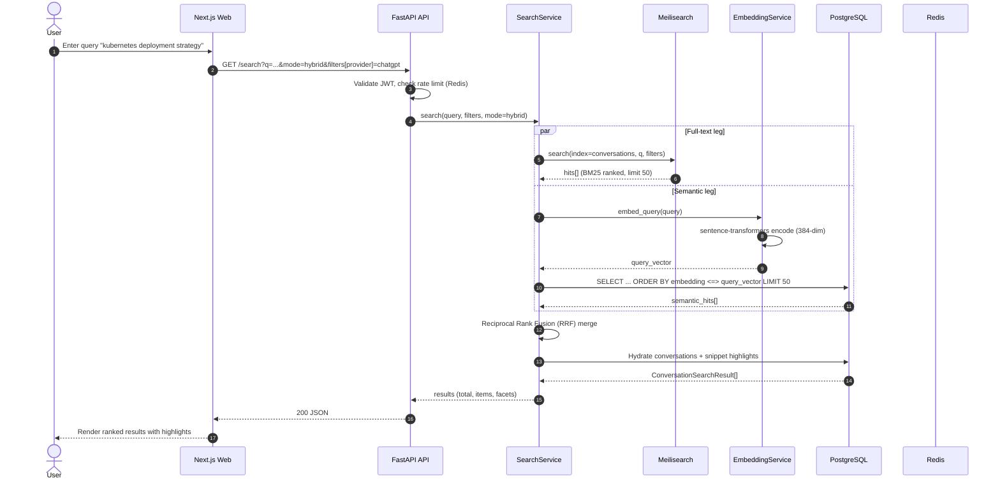
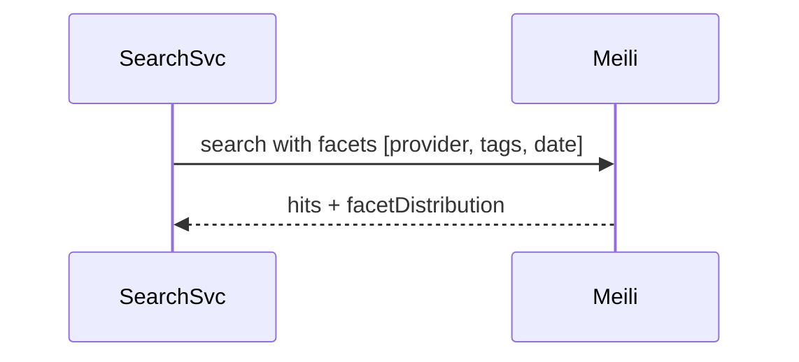
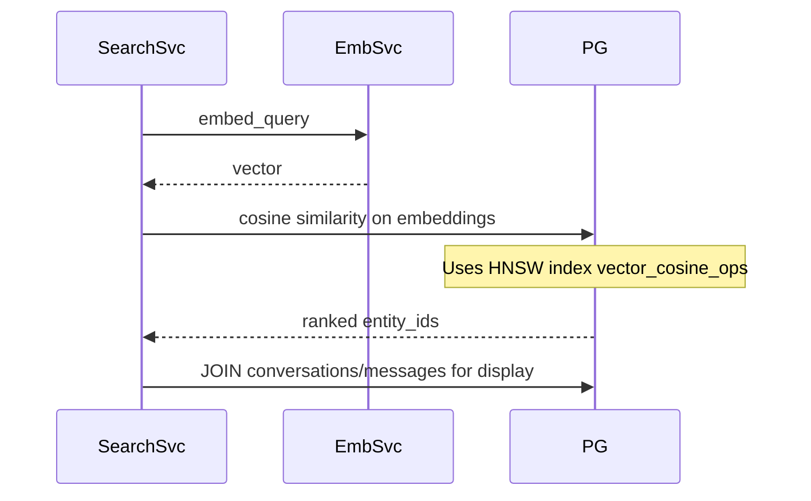
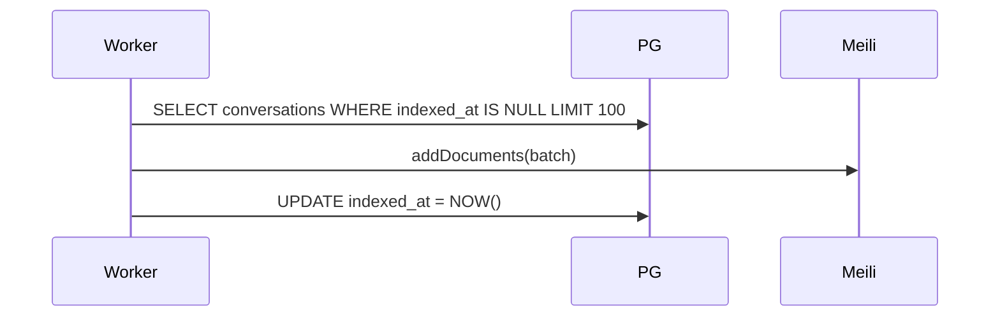

# Sequence Diagram — Search

Hybrid search across Meilisearch (full-text) and pgvector (semantic).

---

## Mode: fulltext only

## Mode: semantic only

---

## Index Sync (background, post-import)

---

## Performance Targets

| Mode | p95 Target | Bottleneck |
|------|------------|------------|
| fulltext | < 200 ms | Meilisearch |
| semantic | < 500 ms | pgvector HNSW |
| hybrid | < 600 ms | Both + RRF |

---

## Related Documents

- [TDR: pgvector](../tdr/001-pgvector-over-alternatives.md)
- [TDR: Meilisearch](../tdr/002-meilisearch-over-elasticsearch.md)
