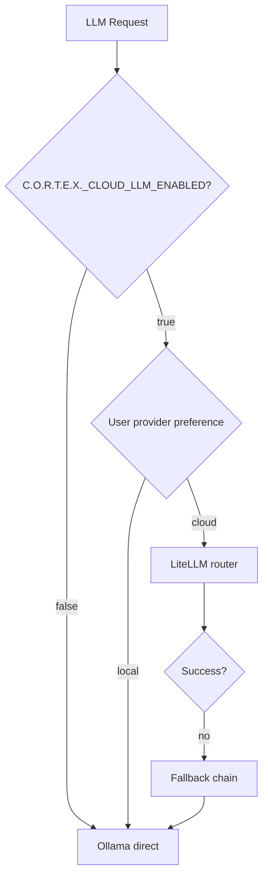

# TDR-004: LiteLLM for AI Routing

| Field | Value |
|-------|-------|
| **Status** | Accepted |
| **Date** | 2026-06-16 |
| **Deciders** | AI Systems Engineer, Principal Architect |

---

## Context

C.O.R.T.E.X. is local-first (Ollama) but must support optional cloud LLM providers for users who opt in: OpenAI, Anthropic, Google Gemini, Perplexity, Grok. Use cases: summarization, artifact generation, knowledge extraction, embeddings fallback.

## Decision

Use **LiteLLM** as the unified cloud LLM routing layer. **Ollama** remains the direct local path (not routed through LiteLLM).

## Alternatives Considered

| Option | Pros | Cons |
|--------|------|------|
| **LiteLLM (chosen)** | 100+ providers; OpenAI-compatible API; fallback chains | Extra dependency; abstraction leaks occasionally |
| **Direct SDK per provider** | Full control | N× integrations; inconsistent error handling |
| **LangChain LLM wrappers** | Chain composition | Heavy; overkill for completion calls |
| **OpenAI SDK only** | Simple | Doesn't cover Anthropic native features |

## Rationale

1. **Single interface:**
   ```python
   response = await litellm.acompletion(
       model="anthropic/claude-3-5-sonnet-20241022",
       messages=[{"role": "user", "content": prompt}],
   )
   ```
2. **Provider fallback chain (opt-in config):**
   ```yaml
   C.O.R.T.E.X._LLM_FALLBACK_CHAIN=ollama/llama3,openai/gpt-4o,anthropic/claude-3-5-sonnet
   ```
3. **Cost tracking:** LiteLLM returns token usage — maps to `conversations.token_count` analytics.
4. **Local-first preserved:** Default config uses Ollama direct HTTP; LiteLLM only loaded when `C.O.R.T.E.X._CLOUD_LLM_ENABLED=true`.
5. **Future-proof:** New providers (Grok, etc.) supported without C.O.R.T.E.X. code changes.

## Routing Logic



## Security

- API keys stored encrypted in `provider_accounts.encrypted_token`
- LiteLLM never logs prompt content (`litellm.set_verbose = False`)
- User must explicitly add cloud provider in Settings → AI Providers
- No default cloud keys in `.env.example`

## Consequences

### Positive
- One integration point for all cloud providers
- Fallback chain improves artifact generation reliability

### Negative
- LiteLLM version pinning required (API changes)
- Some provider-specific features (Claude artifacts) unavailable through abstraction

## References

- [LiteLLM docs](https://docs.litellm.ai/)
